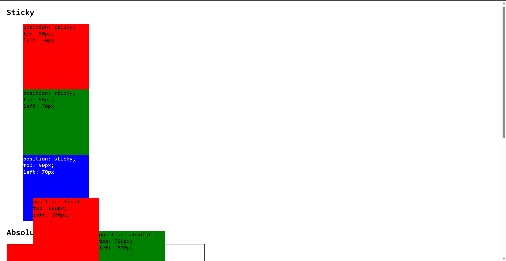
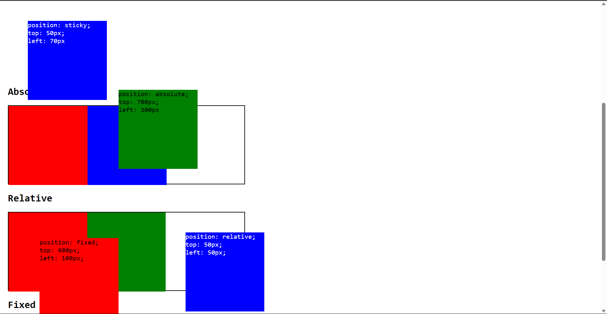
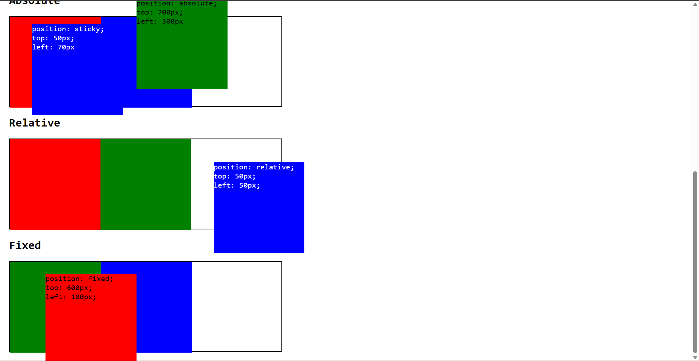

# Question: Difference between absolute and relative and sticky and fixed position explain with example.
### The best way to understand the css position properties is to do it using code
- I have created some boxes
- Those boxes which have any positioning effect are also written inside the boxes eith their effects

## Final Output are in sequence like scrolling the page

