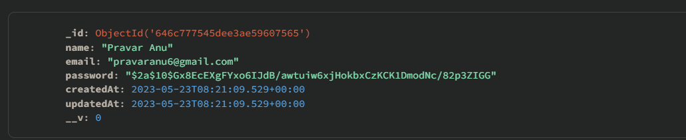
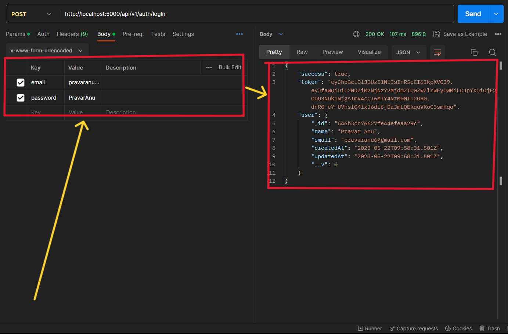
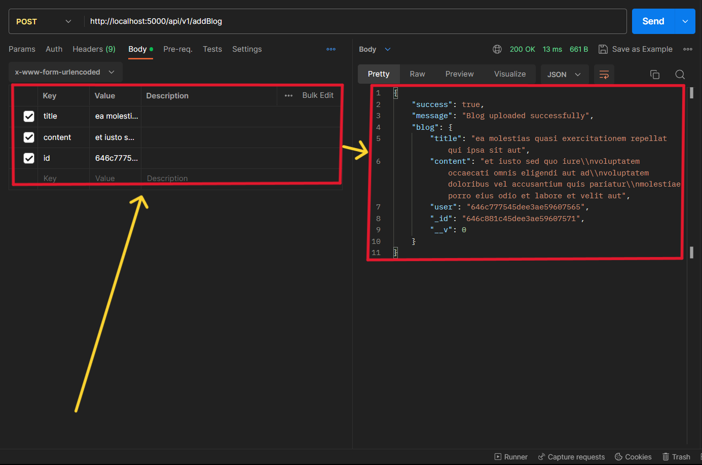
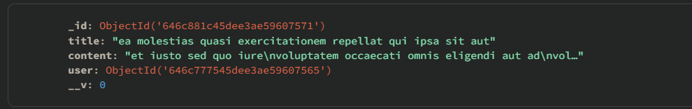
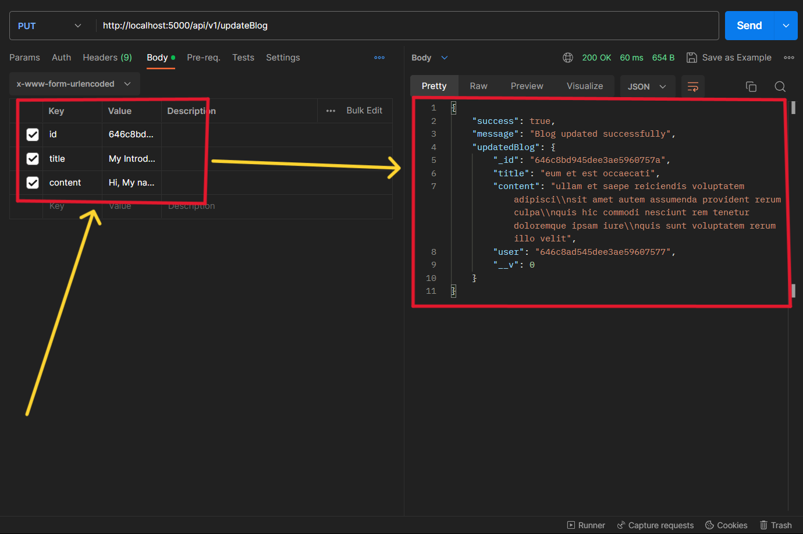
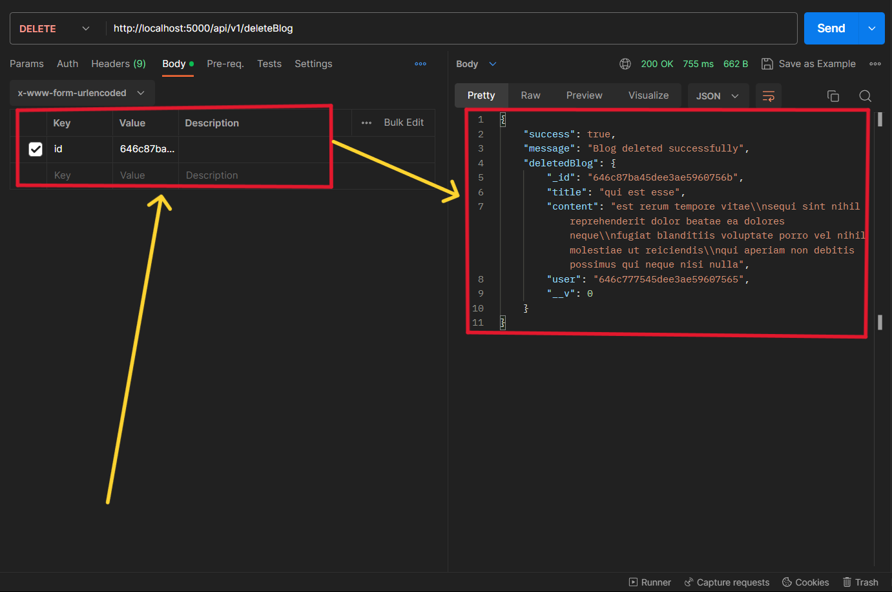
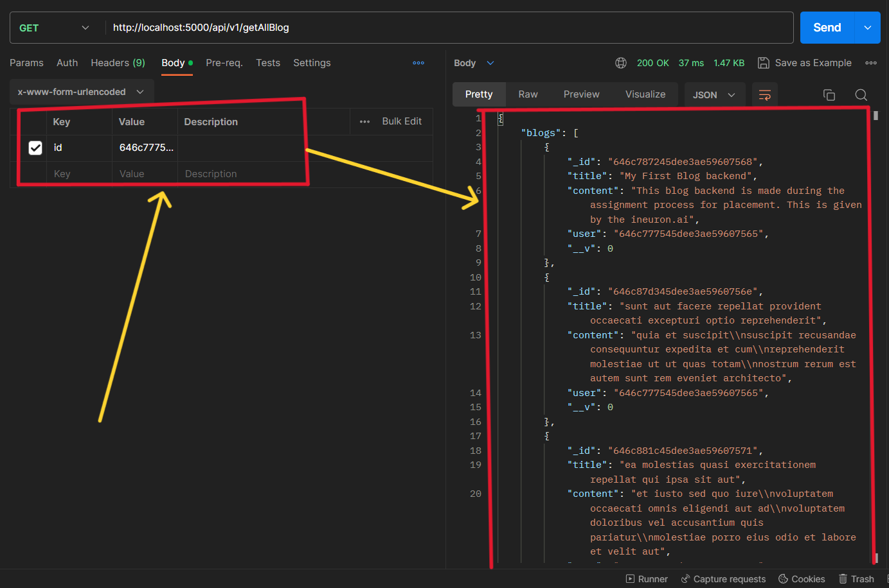

# Q3. Create a backend for blog app where user can perform crud operations
- **Add blog**
- **Delete blog**
- **Update blog**
- **Replace blog**
---

### This project is made using the help of Node and some libraries that are as follows
- express - For creating a server
- dotenv - For hiding secret/api keys
- mongoose - For Database.
- nodemon - For monitoring the changes in file during live running.
- bcryptjs - For encryption purpose
- cookie-parser - For parsing cookie stored in browser
- jsonwebtoken - For creating a token which is encrypted and has information of user and this token is stored as cookie.

## I have also defined some routes for this project
- **api/v1/auth/signUp** - This is a `POST` request used for signing up a new user with name, email, password as value given through the body.

The user is created in the Database 
- **api/v1/auth/logIn** - This is a `POST` request used for logIn a user with email, password as value given through the body.

- **api/v1/addBlog** - This is a `POST` request where a user can send a blog to the Database with some required fields and it values as shown in the pic below

The blog is added in the databse 
- **api/v1/updateBlog** -This is a `PUT` request where a user can update or replace a blog with updated/replaced values of title and content fields as shown in the pic below 
- **api/v1/deleteBlog** -This is a `DELETE` request where a user can delete a blog by providing the id of the blog.

- **api/v1/getBlogs** - This is a `GET` request where a user can request all of its blogs with it userId.

