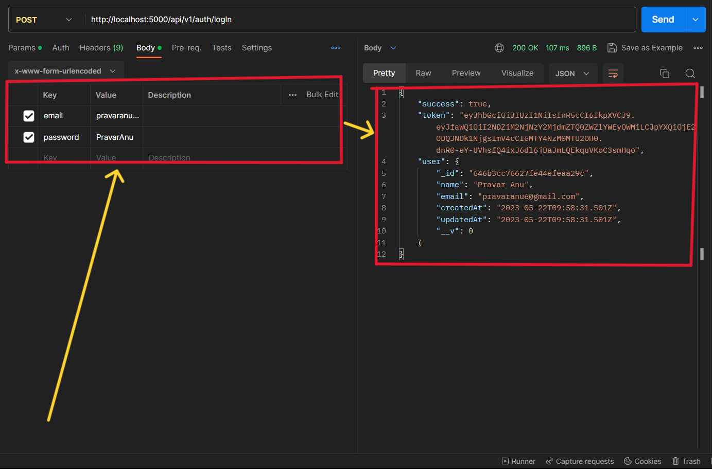

# What is JWT and what we can achieve with that create a minor project with jwt.
- **Login and sign up**
- **Add authentication using jwt** 

### I have created this project using Node and some libraries: 
- express - For creating a server
- dotenv - For hiding secret/api keys
- mongoose - For Database.
- nodemon - For monitoring the changes in file during live running.
- bcryptjs - For encryption purpose
- cookie-parser - For parsing cookie stored in browser
- jsonwebtoken - For creating a token which is encrypted and has information of user and this token is stored as cookie.

## I have also defined some routes for this project
- **api/v1/auth/signUp** - This is a `POST` request used for signing up a new user with name, email, password as value given through the body.

The user is created in the Database 
- **api/v1/auth/logIn** - This is a `POST` request used for logIn a user with email, password as value given through the body.
