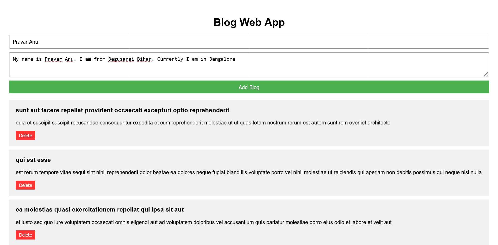

# Create a Blog web app using JavaScript 
- Fetch data from https://jsonplaceholder.typicode.com/posts and show it to ui
- User can also add new blog
- Add Delete functionality also

### I have created it using pure HTML, CSS, Javascript with all the features mentioned in the question

## OUTPUT
### Homepage

### Here you can write your blog like this

### After adding blog the blog will be shown at the end of the page
