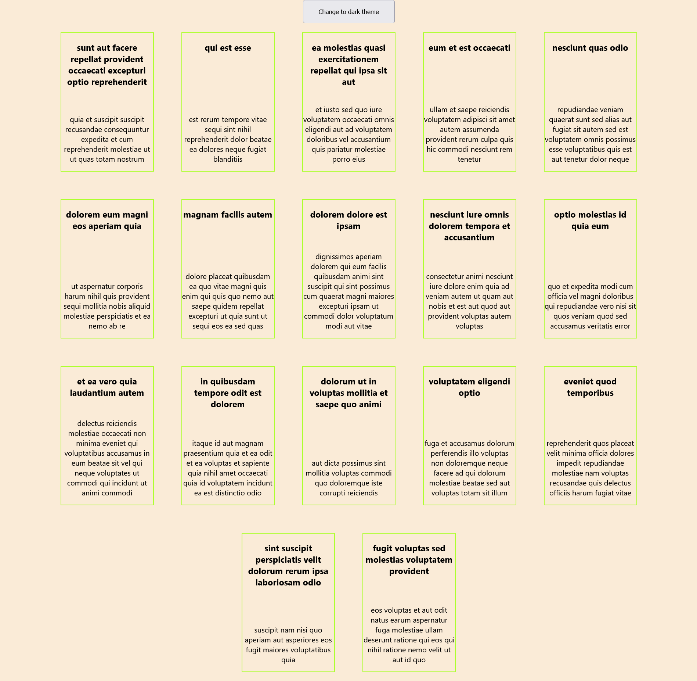
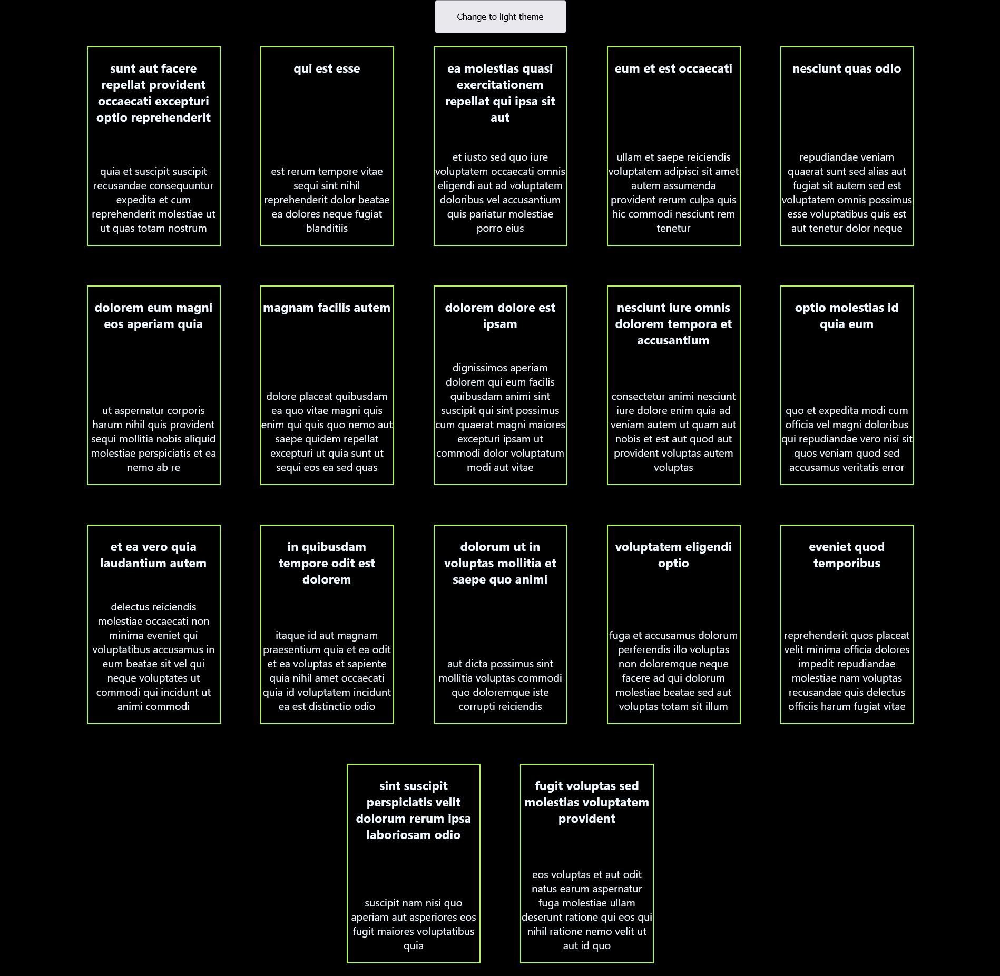

# Create dashboard and with button on clicking on that change theme to dark and light

### Tom make this project I used the context api provided by react which help us from prop drilling.

## Here is the screenshot of my project
### Light theme:

### Dark Theme:
